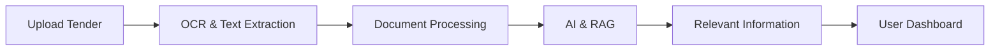

# 🚀 GeM Portal

## AI-Powered Government Tender & Document Intelligence

GeM Portal is an intelligent platform designed to help users efficiently process, understand, and extract key information from complex government tender documents using AI, OCR, and advanced search capabilities.

> Built for Smart India Hackathon (SIH)

## 💡 1. PROBLEM

Government tender documents can be large, complex, and difficult to understand. Important requirements, eligibility conditions, dates, clauses, and supporting documents may be spread across many pages.

Manual searching and verification takes time and can lead to missed information, making the tender bidding and evaluation process slow and error-prone.

## 🎯 2. OUR SOLUTION

Our platform automates and simplifies the analysis of tender documents. It uses Optical Character Recognition (OCR) to extract text from scanned files, and Natural Language Processing (NLP) powered by AI to understand the content. 

By leveraging RAG (Retrieval-Augmented Generation), users can ask questions about the document and get accurate answers instantly. The system also supports document processing and secure verification workflows to ensure compliance and authenticity.

## 🧠 3. HOW IT WORKS

## 🛠️ 4. TECHNOLOGY

The project uses a scalable monorepo architecture:

- **Frontend:** React, Vite, TypeScript, Tailwind CSS
- **API Gateway:** Node.js, Express, TypeScript
- **AI Backend:** Python, FastAPI, LangChain, Llama 3, OCR Tools (PaddleOCR, Tesseract)
- **Integrations:** DigiLocker, GeM APIs, Government verification

### ⚠️ Important Database Note
For the **CURRENT DEMO**, we are using **MongoDB**. 
The original long-term production architecture is designed to use **PostgreSQL + pgvector** to support native AI vector search. However, PostgreSQL + pgvector is **NOT** the current demo database. The system is built with repository interfaces to allow swapping databases seamlessly in the future.

## ✨ 5. FEATURES

| Feature | What it does |
|---------|--------------|
| 📄 Document Processing | Processes uploaded tender documents |
| 🔍 OCR | Extracts text from scanned documents |
| 🧠 Tender Understanding | Identifies important tender information |
| 📌 Clause Extraction | Finds important clauses and requirements |
| 🔎 Smart Search | Retrieves relevant information |
| 🤖 AI Assistant | Answers questions using document context |
| 🔐 Verification | Supports verification workflows |
| 🤝 Consent Verification | Supports consent-based verification |
| 🧾 Audit Trail | Keeps track of important activities |

## 📊 6. CURRENT STATUS

The project is currently in the **Architectural Scaffolding Phase**. 
- Directory structures, API routing, and Docker configurations are established.
- The features listed above are **Planned** and **Under Development**.
- Business functionality and UI implementation are upcoming.

## 🚀 7. FUTURE SCOPE

- Full integration of AI extraction pipelines and LLMs.
- Live deployment to MeghRaj / NIC Cloud.
- Transition from MongoDB to PostgreSQL + pgvector for optimized embeddings retrieval.
